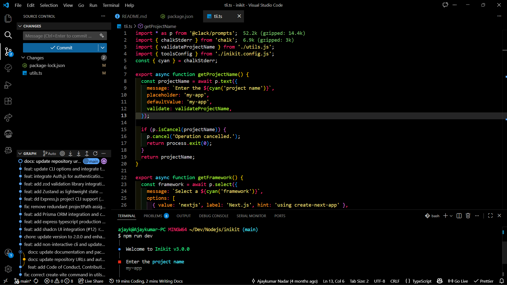

Monokai True Dark
=================

A VS Code theme that keeps classic Monokai vibrancy while swapping in a true dark background for higher contrast and less eye strain.



What you get
------------
- True dark canvas (`#1c1c1c`) with muted UI chrome
- Punchy Monokai accents: pink keywords `#f92672`, yellow strings `#e6db74`, cyan punctuation `#49e0fd`
- Bright green functions `#b0ec38` and teal types `#2be98a` for quick scanning
- Softer comments `#696d70` to keep focus on active code

Install
-------
1. In VS Code, open the Extensions view (`Ctrl+Shift+X`).
2. Search for **Monokai True Dark** by *ajaykumarn3000*.
3. Click **Install**, then set it as your color theme when prompted.

Manual install (VSIX)
---------------------
1. Download the latest release from the [GitHub releases page](https://github.com/ajaykumarn3000/monokai-true-dark/releases).
2. In VS Code, run `Extensions: Install from VSIX...` and pick the downloaded file.

Recommended settings
--------------------
```json
{
	"editor.semanticHighlighting.enabled": false,
	"workbench.colorTheme": "Monokai True Dark"
}
```

Contributing
------------
- Open issues or PRs at the repo: https://github.com/ajaykumarn3000/monokai-true-dark
- To test locally: clone, run `npm install`, press `F5` in VS Code to launch the Extension Host, and pick **Monokai True Dark** in the Command Palette.

License
-------
MIT
